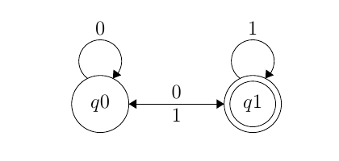

# DFA-check

DFA-check library provides basic functions to create, and verify Deterministic Finite State Automata (DFA). 

## Install

First, clone the repository:

```
git clone https://github.com/AlexanderJDupree/DFA-Check.git
```

Then, with the [Haskell Tool Stack](https://docs.haskellstack.org/en/stable/README/#how-to-install) installed, change into the directory and run:

```
stack setup
stack build
```

## Usage

For simplicity, I have been using [hspec](https://hspec.github.io/) to verify DFA's as unit tests. To do this, simply create a file for the DFA you want to test and use the DFA-check library to create the machine. For example, lets make and test a DFA that only accepts binary strings that end in '1', as represented in this diagram:



To do this we need to create the test file first:

```bash
touch test/OddBinaryStringSpec.hs
```

*Note:* It is important for all test files to end with the postfix `Spec.hs`. This allows the hspec library to perform discovery. 

Then open the 'OddBinaryStringSpec.hs' file in your favorite text editor and add the following lines. 

```haskell

{-# LANGUAGE OverloadedLists #-}

module OddBinaryStringSpec where

import DFA
import Test.Hspec

-- list States
data State = Q0 |Q1
    deriving (Eq, Ord, Read, Show)

-- Define Symbol type
type Symbol = Char

-- Transition function
m1Delta :: State -> Symbol -> State
m1Delta Q0 '0' = Q0
m1Delta Q0 '1'  = Q1
m1Delta Q1 '0' = Q0
m1Delta Q1 '1'  = Q1

m1 = DFA { states   = [Q0, Q1]
         , alphabet = ['0', '1']
         , delta    = m1Delta
         , start    = Q0
         , accept   = [Q1]
         }

-- Accepted strings
language  = ["1", "01", "1011", "1001"]
-- Rejected strings
language' = ["0", "10", "1010"]

main :: IO ()
main = hspec spec

-- Actual unit tests
spec :: Spec
spec = do
  describe "Odd Binary String recognizer"
    $ context "when given any odd binary string"
    $ it "evaluates to true"
    -- Evaluate machine over entire language
    $ map (eval m1) language `shouldBe` [True, True, True, True]

  describe "Odd Binary String recognizer"
    $ context "when given any even binary string"
    $ it "evaluates to false"
    $ map (eval m1) language' `shouldBe` [False, False, False]

```

Then to verify that the DFA accepts the specified language, run:

```
stack test
```

